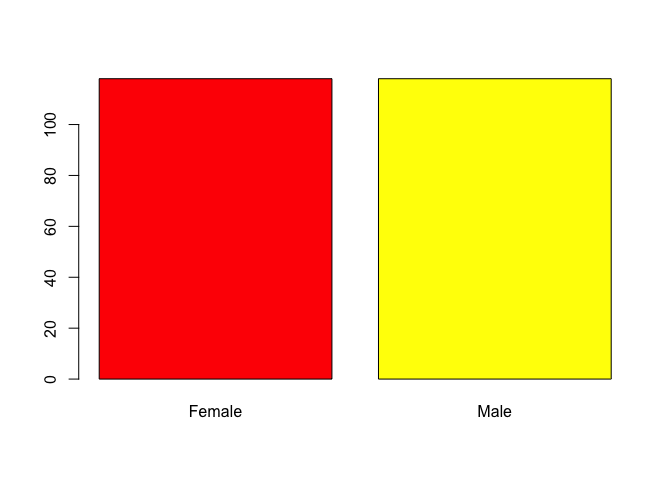

Ejercicio3
================
AE
24/7/2018

Ejercicio 3
-----------

Cargue usando la función “data”, la base llamada survey. Está incluida en el paquete MASS, así que no se olvide de llamar este paquete

``` r
install.packages("MASS", repos = "http://cran.us.r-project.org", dependencies = TRUE)
```

    ## Installing package into '/Users/anaescoto/Library/R/3.3/library'
    ## (as 'lib' is unspecified)

    ## 
    ##   There is a binary version available but the source version is
    ##   later:
    ##      binary source needs_compilation
    ## MASS 7.3-48 7.3-50              TRUE

    ## installing the source package 'MASS'

    ## Warning in install.packages("MASS", repos = "http://cran.us.r-
    ## project.org", : installation of package 'MASS' had non-zero exit status

``` r
library(MASS)
data(survey)
survey
```

    ##        Sex Wr.Hnd NW.Hnd W.Hnd    Fold Pulse    Clap Exer Smoke Height
    ## 1   Female   18.5   18.0 Right  R on L    92    Left Some Never 173.00
    ## 2     Male   19.5   20.5  Left  R on L   104    Left None Regul 177.80
    ## 3     Male   18.0   13.3 Right  L on R    87 Neither None Occas     NA
    ## 4     Male   18.8   18.9 Right  R on L    NA Neither None Never 160.00
    ## 5     Male   20.0   20.0 Right Neither    35   Right Some Never 165.00
    ## 6   Female   18.0   17.7 Right  L on R    64   Right Some Never 172.72
    ## 7     Male   17.7   17.7 Right  L on R    83   Right Freq Never 182.88
    ## 8   Female   17.0   17.3 Right  R on L    74   Right Freq Never 157.00
    ## 9     Male   20.0   19.5 Right  R on L    72   Right Some Never 175.00
    ## 10    Male   18.5   18.5 Right  R on L    90   Right Some Never 167.00
    ## 11  Female   17.0   17.2 Right  L on R    80   Right Freq Never 156.20
    ## 12    Male   21.0   21.0 Right  R on L    68    Left Freq Never     NA
    ## 13  Female   16.0   16.0 Right  L on R    NA   Right Some Never 155.00
    ## 14  Female   19.5   20.2 Right  L on R    66 Neither Some Never 155.00
    ## 15    Male   16.0   15.5 Right  R on L    60   Right Some Never     NA
    ## 16  Female   17.5   17.0 Right  R on L    NA   Right Freq Never 156.00
    ## 17  Female   18.0   18.0 Right  L on R    89 Neither Freq Never 157.00
    ## 18    Male   19.4   19.2  Left  R on L    74   Right Some Never 182.88
    ## 19    Male   20.5   20.5 Right  L on R    NA    Left Some Never 190.50
    ## 20    Male   21.0   20.9 Right  R on L    78   Right Freq Never 177.00
    ## 21    Male   21.5   22.0 Right  R on L    72    Left Freq Never 190.50
    ## 22    Male   20.1   20.7 Right  L on R    72   Right Freq Never 180.34
    ## 23    Male   18.5   18.0 Right  L on R    64   Right Freq Never 180.34
    ## 24    Male   21.5   21.2 Right  R on L    62   Right Some Never 184.00
    ## 25  Female   17.0   17.5 Right  R on L    64    Left Some Never     NA
    ## 26    Male   18.5   18.5 Right Neither    90 Neither Some Never     NA
    ## 27    Male   21.0   20.7 Right  R on L    90   Right Some Never 172.72
    ## 28    Male   20.8   21.4 Right  R on L    62 Neither Freq Never 175.26
    ## 29    Male   17.8   17.8 Right  L on R    76 Neither Freq Never     NA
    ## 30    Male   19.5   19.5 Right  L on R    79   Right Some Never 167.00
    ## 31  Female   18.5   18.0 Right  R on L    76   Right None Occas     NA
    ## 32    Male   18.8   18.2 Right  L on R    78   Right Freq Never 180.00
    ## 33  Female   17.1   17.5 Right  R on L    72   Right Freq Heavy 166.40
    ## 34    Male   20.1   20.0 Right  R on L    70   Right Some Never 180.00
    ## 35    Male   18.0   19.0 Right  L on R    54 Neither Some Regul     NA
    ## 36    Male   22.2   21.0 Right  L on R    66   Right Freq Occas 190.00
    ## 37  Female   16.0   16.5 Right  L on R    NA   Right Some Never 168.00
    ## 38    Male   19.4   18.5 Right  R on L    72 Neither Freq Never 182.50
    ## 39    Male   22.0   22.0 Right  R on L    80   Right Some Never 185.00
    ## 40    Male   19.0   19.0 Right  R on L    NA Neither Freq Occas 171.00
    ## 41  Female   17.5   16.0 Right  L on R    NA   Right Some Never 169.00
    ## 42  Female   17.8   18.0 Right  R on L    72   Right Some Never 154.94
    ## 43    Male     NA     NA Right  R on L    60    <NA> Some Never 172.00
    ## 44  Female   20.1   20.2 Right  L on R    80   Right Some Never 176.50
    ## 45  Female   13.0   13.0  <NA>  L on R    70    Left Freq Never 180.34
    ## 46    Male   17.0   17.5 Right  R on L    NA Neither Freq Never 180.34
    ## 47    Male   23.2   22.7 Right  L on R    84    Left Freq Regul 180.00
    ## 48    Male   22.5   23.0 Right  R on L    96   Right None Never 170.00
    ## 49  Female   18.0   17.6 Right  R on L    60   Right Some Occas 168.00
    ## 50  Female   18.0   17.9 Right  R on L    50    Left None Never 165.00
    ## 51    Male   22.0   21.5  Left  R on L    55    Left Freq Never 200.00
    ## 52    Male   20.5   20.0 Right  L on R    68   Right Freq Never 190.00
    ## 53    Male   17.0   18.0 Right  L on R    78    Left Some Never 170.18
    ## 54    Male   20.5   19.5 Right  L on R    56   Right Freq Never 179.00
    ## 55    Male   22.5   22.5 Right  R on L    65   Right Freq Regul 182.00
    ## 56    Male   18.5   18.5 Right  L on R    NA Neither Freq Never 171.00
    ## 57  Female   15.5   15.4 Right  R on L    70 Neither None Never 157.48
    ## 58    Male   19.5   19.7 Right  R on L    72   Right Freq Never     NA
    ## 59    Male   19.5   19.0 Right  L on R    62   Right Freq Never 177.80
    ## 60    Male   20.6   21.0  Left  L on R    NA    Left Freq Occas 175.26
    ## 61    Male   22.8   23.2 Right  R on L    66 Neither Freq Never 187.00
    ## 62  Female   18.5   18.2 Right  R on L    72 Neither Freq Never 167.64
    ## 63  Female   19.6   19.7 Right  L on R    70   Right Freq Never 178.00
    ## 64  Female   18.7   18.0  Left  L on R    NA    Left None Never 170.00
    ## 65  Female   17.3   18.0 Right  L on R    64 Neither Freq Never 164.00
    ## 66    Male   19.5   19.8 Right Neither    NA   Right Freq Never 183.00
    ## 67  Female   19.0   19.1 Right  L on R    NA Neither Freq Never 172.00
    ## 68  Female   18.5   18.0 Right  R on L    64   Right Freq Never     NA
    ## 69    Male   19.0   19.0 Right  L on R    NA   Right Some Never 180.00
    ## 70    Male   21.0   19.5 Right  L on R    80    Left None  <NA>     NA
    ## 71  Female   18.0   17.5 Right  L on R    64    Left Freq Never 170.00
    ## 72    Male   19.4   19.5 Right  R on L    NA   Right Freq Heavy 176.00
    ## 73  Female   17.0   16.6 Right  R on L    68   Right Some Never 171.00
    ## 74  Female   16.5   17.0 Right  L on R    40    Left Freq Never 167.64
    ## 75  Female   15.6   15.8 Right  R on L    88    Left Some Never 165.00
    ## 76  Female   17.5   17.5 Right Neither    68   Right Freq Heavy 170.00
    ## 77  Female   17.0   17.6 Right  L on R    76   Right Some Never 165.00
    ## 78  Female   18.6   18.0 Right  L on R    NA Neither Freq Heavy 165.10
    ## 79  Female   18.3   18.5 Right  R on L    68 Neither Some Never 165.10
    ## 80    Male   20.0   20.5 Right  L on R    NA   Right Freq Never 185.42
    ## 81    Male   19.5   19.5  Left  R on L    66    Left Some Never     NA
    ## 82    Male   19.2   18.9 Right  R on L    76   Right Freq Never 176.50
    ## 83  Female   17.5   17.5 Right  R on L    98    Left Freq Never     NA
    ## 84  Female   17.0   17.4 Right  R on L    NA Neither Some Never     NA
    ## 85    Male   23.0   23.5 Right  L on R    90   Right Freq Never 167.64
    ## 86  Female   17.7   17.0 Right  R on L    76   Right Some Never 167.00
    ## 87  Female   18.2   18.0 Right  L on R    70   Right Some Never 162.56
    ## 88  Female   18.3   18.5 Right  R on L    75    Left Freq Never 170.00
    ## 89    Male   18.0   18.0 Right Neither    60   Right Freq Never 179.00
    ## 90  Female   18.0   17.7  Left  R on L    92    Left Some Never     NA
    ## 91    Male   20.5   20.0 Right  R on L    75    Left Some Never 183.00
    ## 92  Female   17.5   18.0 Right Neither    NA   Right Some Never     NA
    ## 93  Female   18.2   17.5 Right  L on R    70   Right Some Never 165.00
    ## 94  Female   18.2   18.5 Right  R on L    NA   Right Some Never 168.00
    ## 95    Male   21.3   20.8 Right  R on L    65   Right Freq Heavy 179.00
    ## 96  Female   19.0   18.8 Right  L on R    NA   Right Some Never     NA
    ## 97    Male   20.0   19.5 Right  R on L    68 Neither Freq Regul 190.00
    ## 98  Female   17.5   17.5 Right  R on L    60   Right Freq Never 166.50
    ## 99    Male   19.5   19.4 Right Neither    NA   Right Freq Never 165.00
    ## 100 Female   19.4   19.6 Right  R on L    68 Neither Freq Never 175.26
    ## 101   Male   21.9   22.2 Right  R on L    NA   Right Some Never 187.00
    ## 102   Male   18.9   19.1 Right  L on R    60 Neither None Never 170.00
    ## 103 Female   16.0   16.0 Right Neither    NA   Right Some Never 159.00
    ## 104 Female   17.5   17.3 Right  R on L    72   Right Freq Never 175.00
    ## 105 Female   17.5   17.0 Right  R on L    80    Left Some Heavy 163.00
    ## 106 Female   19.5   18.5 Right  R on L    80   Right Some Never 170.00
    ## 107 Female   16.2   16.4 Right  R on L    NA   Right Freq Occas 172.00
    ## 108 Female   17.0   15.9 Right  R on L    85   Right Freq Never     NA
    ## 109   Male   17.5   17.5 Right  L on R    64 Neither Freq Never 180.00
    ## 110   Male   19.7   20.1 Right  R on L    67    Left Some Regul 180.34
    ## 111 Female   18.5   18.5 Right  R on L    76    Left Freq Never 175.00
    ## 112   Male   19.2   19.6 Right  L on R    80   Right None Never 190.50
    ## 113 Female   17.2   16.7 Right  R on L    75   Right Freq Never 170.18
    ## 114   Male   20.5   21.0 Right  R on L    60   Right Freq Never 185.00
    ## 115 Female   16.0   15.5 Right  L on R    60    Left Freq Never 162.56
    ## 116 Female   16.9   16.0 Right  L on R    70   Right None Never 158.00
    ## 117 Female   17.0   16.7 Right  R on L    70   Right Some Never 159.00
    ## 118   Male   23.0   22.0  Left  L on R    83    Left Some Heavy 193.04
    ## 119 Female   18.5   18.0  Left  L on R   100 Neither Some Never 171.00
    ## 120   Male   21.0   20.4 Right  L on R   100   Right Freq Heavy 184.00
    ## 121   Male   20.0   20.0 Right  R on L    80 Neither Freq Occas     NA
    ## 122   Male   22.5   22.5 Right  L on R    76   Right Freq Occas 177.00
    ## 123 Female   18.5   18.0 Right  R on L    92   Right Freq Never 172.00
    ## 124   Male   19.8   20.0  Left  L on R    59   Right Freq Never 180.00
    ## 125   Male   18.5   18.1 Right  L on R    66    Left Freq Never 175.26
    ## 126   Male   19.3   19.4 Right  R on L    NA   Right Freq Never 180.34
    ## 127 Female   16.0   16.0 Right  R on L    68   Right Freq Never 172.72
    ## 128   Male   18.8   19.1 Right  L on R    66 Neither Freq Regul 178.50
    ## 129 Female   17.5   17.0 Right  R on L    74   Right Freq Never 157.00
    ## 130 Female   16.4   16.5 Right  L on R    90   Right Some Never 152.00
    ## 131   Male   22.0   21.5 Right  R on L    86   Right Freq Never 187.96
    ## 132   Male   19.0   19.5 Right  L on R    60   Right Some Never 178.00
    ## 133 Female   18.9   20.0 Right  R on L    86   Right Some Never     NA
    ## 134 Female   15.4   16.4  Left  L on R    80    Left Freq Occas 160.02
    ## 135   Male   17.9   17.8 Right  R on L    85    Left Some Never 175.26
    ## 136   Male   23.1   22.5 Right  L on R    90   Right Some Regul 189.00
    ## 137   <NA>   19.8   19.0  Left  L on R    73 Neither Freq Never 172.00
    ## 138   Male   22.0   22.0 Right  L on R    72   Right Freq Never 182.88
    ## 139   Male   20.0   19.5 Right  L on R    NA   Right Freq Never 170.00
    ## 140 Female   19.5   18.5 Right  L on R    68   Right None Never 167.00
    ## 141 Female   18.0   18.6 Right  R on L    84   Right Some Never 175.00
    ## 142 Female   18.3   19.0 Right  R on L    NA   Right None Never 165.00
    ## 143 Female   19.0   18.8 Right  R on L    65   Right Freq Never 172.72
    ## 144   Male   21.4   21.0 Right  L on R    96 Neither Some Never 180.00
    ## 145 Female   20.0   19.5  Left  R on L    68 Neither Freq Never 172.00
    ## 146   Male   18.5   18.5 Right  R on L    75 Neither Some Never 185.00
    ## 147   Male   22.5   22.6 Right  L on R    64   Right Freq Regul 187.96
    ## 148   Male   19.5   20.2 Right  R on L    60 Neither Freq Never 185.42
    ## 149 Female   18.0   18.0 Right  L on R    92 Neither Freq Never 165.00
    ## 150 Female   18.0   18.5 Right  R on L    64 Neither Freq Never 164.00
    ## 151   Male   21.8   22.3 Right  R on L    76    Left Freq Never 195.00
    ## 152 Female   13.0   12.5 Right  L on R    80   Right Freq Never 165.00
    ## 153 Female   16.3   16.2 Right  L on R    92   Right Some Regul 152.40
    ## 154   Male   21.5   21.6 Right  R on L    69   Right Freq Never 172.72
    ## 155   Male   18.9   19.1 Right  L on R    68   Right None Never 180.34
    ## 156   Male   20.5   20.0 Right  R on L    76   Right Freq Never 173.00
    ## 157   Male   14.0   15.5 Right  L on R    NA Neither Freq Heavy     NA
    ## 158 Female   18.9   19.2 Right  L on R    74   Right Some Never 167.64
    ## 159   Male   20.0   20.5 Right  R on L    NA   Right None Never 187.96
    ## 160   Male   18.5   19.0 Right  L on R    84   Right Freq Regul 187.00
    ## 161 Female   17.5   17.1 Right  R on L    80    Left None Never 167.00
    ## 162   Male   18.1   18.2  Left Neither    NA   Right Some Never 168.00
    ## 163   Male   20.2   20.3 Right  L on R    72 Neither Some Never 191.80
    ## 164 Female   16.5   16.9 Right  R on L    60 Neither Freq Occas 169.20
    ## 165   Male   19.1   19.1 Right Neither    NA   Right Some Never 177.00
    ## 166 Female   17.6   17.2 Right  R on L    81    Left Some Never 168.00
    ## 167 Female   19.5   19.2 Right  R on L    70   Right Some Never 170.00
    ## 168 Female   16.5   15.0 Right  L on R    65   Right Some Regul 160.02
    ## 169   Male   19.0   18.5 Right  L on R    NA Neither Freq Never 189.00
    ## 170   Male   19.0   18.5 Right  R on L    72   Right Freq Never 180.34
    ## 171 Female   16.5   17.0 Right  L on R    NA   Right Some Never 168.00
    ## 172   Male   20.5   19.5  Left  L on R    80   Right Some Occas 182.88
    ## 173 Female   15.5   15.5 Right Neither    50   Right Some Regul     NA
    ## 174 Female   18.0   17.5 Right  R on L    48 Neither Freq Never 165.00
    ## 175 Female   17.5   18.0 Right  R on L    68 Neither Freq Never 157.48
    ## 176 Female   19.0   18.5  Left  L on R   104    Left Freq Never 170.00
    ## 177   Male   20.5   20.5 Right Neither    76   Right Freq Regul 172.72
    ## 178 Female   16.7   17.0 Right  L on R    84    Left Freq Never 164.00
    ## 179 Female   20.5   20.5 Right  R on L    NA    Left Freq Regul     NA
    ## 180 Female   17.0   16.5 Right  R on L    70   Right Some Never 162.56
    ## 181   Male   19.0   19.5 Right  R on L    68   Right Freq Occas 172.00
    ## 182 Female   14.0   13.5 Right  R on L    87 Neither Freq Occas 165.10
    ## 183 Female   17.5   17.6 Right  L on R    79   Right Some Never 162.50
    ## 184   Male   18.5   19.0 Right  L on R    70    Left Freq Never 170.00
    ## 185   Male   18.0   18.5 Right Neither    90   Right Some Never 175.00
    ## 186   Male   20.5   20.7 Right  R on L    72   Right Some Never 168.00
    ## 187 Female   17.0   17.0 Right  L on R    79   Right Some Never 163.00
    ## 188   Male   18.5   18.5 Right  R on L    65   Right None Never 165.00
    ## 189   Male   18.0   18.5 Right  R on L    62   Right Freq Never 173.00
    ## 190   Male   18.5   18.0 Right Neither    63 Neither Freq Never 196.00
    ## 191   Male   20.0   19.5 Right  R on L    92   Right Some Never 179.10
    ## 192   Male   22.0   22.5 Right  L on R    60   Right Some Never 180.00
    ## 193   Male   17.9   18.4 Right  R on L    68    Left None Occas 176.00
    ## 194 Female   17.6   17.8 Right  L on R    72    Left Some Never 160.02
    ## 195 Female   16.7   15.1 Right Neither    NA   Right None Never 157.48
    ## 196 Female   17.0   17.6 Right  L on R    76   Right Some Never 165.00
    ## 197 Female   15.0   13.0 Right  R on L    80 Neither Freq Never 170.18
    ## 198   Male   16.0   15.5 Right Neither    71   Right Freq Never 154.94
    ## 199 Female   19.1   19.0 Right  R on L    80   Right Some Occas 170.00
    ## 200 Female   17.5   16.5 Right  R on L    80 Neither Some Never 164.00
    ## 201 Female   16.2   15.8 Right  R on L    61   Right Some Occas 167.00
    ## 202   Male   21.0   21.0 Right  L on R    48 Neither Freq Never 174.00
    ## 203 Female   18.8   17.8 Right  R on L    76   Right Some Never     NA
    ## 204 Female   18.5   18.0 Right Neither    86   Right None Never 160.00
    ## 205   Male   17.0   17.5 Right  R on L    80   Right Some Regul 179.10
    ## 206 Female   17.5   17.0 Right  R on L    83 Neither Freq Occas 168.00
    ## 207 Female   17.5   17.6 Right  L on R    76   Right Some Never 153.50
    ## 208   Male   17.5   17.6 Right  R on L    84   Right Some Never 160.00
    ## 209   Male   17.5   17.0  Left  L on R    97 Neither None Never 165.00
    ## 210 Female   20.8   20.7 Right  R on L    NA Neither Freq Never 171.50
    ## 211 Female   18.6   18.6 Right  L on R    74   Right Some Never 160.00
    ## 212 Female   17.5   17.5  Left  R on L    83 Neither Some Never 163.00
    ## 213   Male   18.0   18.5 Right  R on L    78   Right Freq Never     NA
    ## 214   Male   17.0   17.5 Right  R on L    65   Right Some Never 165.00
    ## 215 Female   18.0   17.8 Right  L on R    68   Right Some Never 168.90
    ## 216   Male   19.5   20.0 Right Neither    NA   Right Some Never 170.00
    ## 217 Female   16.3   16.2 Right  L on R    NA   Right None Never     NA
    ## 218   Male   18.2   19.8 Right  R on L    88   Right Freq Never 185.00
    ## 219 Female   17.0   17.3 Right  L on R    NA Neither Freq Never 173.00
    ## 220   Male   23.2   23.2 Right  L on R    75   Right Freq Never 188.00
    ## 221   Male   23.2   23.3 Right  L on R    NA   Right None Heavy 171.00
    ## 222 Female   15.9   16.5 Right  R on L    70   Right Freq Never 167.64
    ## 223 Female   17.5   18.4 Right  R on L    88   Right Some Never 162.56
    ## 224 Female   17.5   17.6 Right  L on R    NA   Right Freq Never 150.00
    ## 225 Female   17.6   17.2 Right  L on R    NA   Right Some Never     NA
    ## 226 Female   17.5   17.8 Right  R on L    96   Right Some Never     NA
    ## 227 Female   18.8   18.3 Right  R on L    80   Right Some Heavy 170.18
    ## 228   Male   20.0   19.8 Right  L on R    68   Right Freq Never 185.00
    ## 229 Female   18.6   18.8 Right  L on R    70   Right Freq Regul 167.00
    ## 230   Male   18.6   19.6 Right  L on R    71   Right Freq Occas 185.00
    ## 231 Female   18.8   18.5 Right  R on L    80   Right Some Never 169.00
    ## 232   Male   18.0   16.0 Right  R on L    NA   Right Some Never 180.34
    ## 233 Female   18.0   18.0 Right  L on R    85   Right Some Never 165.10
    ## 234 Female   18.5   18.0 Right  L on R    88   Right Some Never 160.00
    ## 235 Female   17.5   16.5 Right  R on L    NA   Right Some Never 170.00
    ## 236   Male   21.0   21.5 Right  R on L    90   Right Some Never 183.00
    ## 237 Female   17.6   17.3 Right  R on L    85   Right Freq Never 168.50
    ##          M.I    Age
    ## 1     Metric 18.250
    ## 2   Imperial 17.583
    ## 3       <NA> 16.917
    ## 4     Metric 20.333
    ## 5     Metric 23.667
    ## 6   Imperial 21.000
    ## 7   Imperial 18.833
    ## 8     Metric 35.833
    ## 9     Metric 19.000
    ## 10    Metric 22.333
    ## 11  Imperial 28.500
    ## 12      <NA> 18.250
    ## 13    Metric 18.750
    ## 14    Metric 17.500
    ## 15      <NA> 17.167
    ## 16    Metric 17.167
    ## 17    Metric 19.333
    ## 18  Imperial 18.333
    ## 19  Imperial 19.750
    ## 20    Metric 17.917
    ## 21  Imperial 17.917
    ## 22  Imperial 18.167
    ## 23  Imperial 17.833
    ## 24    Metric 18.250
    ## 25      <NA> 19.167
    ## 26      <NA> 17.583
    ## 27  Imperial 17.500
    ## 28  Imperial 18.083
    ## 29      <NA> 21.917
    ## 30    Metric 19.250
    ## 31      <NA> 41.583
    ## 32    Metric 17.500
    ## 33  Imperial 39.750
    ## 34    Metric 17.167
    ## 35      <NA> 17.750
    ## 36    Metric 18.000
    ## 37    Metric 19.000
    ## 38    Metric 17.917
    ## 39    Metric 35.500
    ## 40    Metric 19.917
    ## 41    Metric 17.500
    ## 42  Imperial 17.083
    ## 43    Metric 28.583
    ## 44  Imperial 17.500
    ## 45  Imperial 17.417
    ## 46  Imperial 18.500
    ## 47    Metric 18.917
    ## 48    Metric 19.417
    ## 49    Metric 18.417
    ## 50    Metric 30.750
    ## 51    Metric 18.500
    ## 52    Metric 17.500
    ## 53  Imperial 18.333
    ## 54    Metric 17.417
    ## 55    Metric 20.000
    ## 56    Metric 18.333
    ## 57  Imperial 17.167
    ## 58      <NA> 17.417
    ## 59  Imperial 17.667
    ## 60  Imperial 18.417
    ## 61    Metric 20.333
    ## 62  Imperial 17.333
    ## 63    Metric 17.500
    ## 64    Metric 19.833
    ## 65    Metric 18.583
    ## 66    Metric 18.000
    ## 67    Metric 30.667
    ## 68      <NA> 16.917
    ## 69    Metric 19.917
    ## 70      <NA> 18.333
    ## 71    Metric 17.583
    ## 72    Metric 17.833
    ## 73    Metric 17.667
    ## 74  Imperial 17.417
    ## 75    Metric 17.750
    ## 76    Metric 20.667
    ## 77    Metric 23.583
    ## 78  Imperial 17.167
    ## 79  Imperial 17.083
    ## 80  Imperial 18.750
    ## 81      <NA> 16.750
    ## 82  Imperial 20.167
    ## 83      <NA> 17.667
    ## 84      <NA> 17.167
    ## 85  Imperial 17.167
    ## 86    Metric 17.250
    ## 87  Imperial 18.000
    ## 88    Metric 18.750
    ## 89    Metric 21.583
    ## 90      <NA> 17.583
    ## 91    Metric 19.667
    ## 92      <NA> 18.000
    ## 93    Metric 19.667
    ## 94    Metric 17.083
    ## 95    Metric 22.833
    ## 96      <NA> 17.083
    ## 97    Metric 19.417
    ## 98    Metric 23.250
    ## 99    Metric 18.083
    ## 100 Imperial 19.083
    ## 101   Metric 18.917
    ## 102   Metric 17.750
    ## 103   Metric 20.833
    ## 104   Metric 20.167
    ## 105   Metric 17.667
    ## 106   Metric 18.250
    ## 107   Metric 17.000
    ## 108     <NA> 18.500
    ## 109   Metric 18.583
    ## 110 Imperial 17.750
    ## 111   Metric 24.167
    ## 112 Imperial 18.167
    ## 113 Imperial 21.167
    ## 114   Metric 17.917
    ## 115 Imperial 17.417
    ## 116   Metric 20.500
    ## 117   Metric 22.917
    ## 118 Imperial 18.917
    ## 119   Metric 18.917
    ## 120   Metric 20.083
    ## 121     <NA> 17.500
    ## 122   Metric 18.250
    ## 123   Metric 17.500
    ## 124   Metric 17.417
    ## 125 Imperial 21.000
    ## 126 Imperial 19.833
    ## 127 Imperial 17.667
    ## 128   Metric 18.083
    ## 129   Metric 18.000
    ## 130   Metric 18.333
    ## 131 Imperial 20.000
    ## 132   Metric 18.750
    ## 133     <NA> 19.083
    ## 134 Imperial 18.500
    ## 135 Imperial 18.417
    ## 136   Metric 19.167
    ## 137   Metric 21.500
    ## 138 Imperial 19.333
    ## 139   Metric 21.417
    ## 140   Metric 18.667
    ## 141   Metric 17.500
    ## 142   Metric 21.083
    ## 143 Imperial 17.250
    ## 144   Metric 19.000
    ## 145   Metric 19.167
    ## 146   Metric 19.000
    ## 147 Imperial 23.000
    ## 148 Imperial 32.667
    ## 149   Metric 20.000
    ## 150   Metric 20.167
    ## 151   Metric 25.500
    ## 152   Metric 18.167
    ## 153 Imperial 23.500
    ## 154 Imperial 70.417
    ## 155 Imperial 43.833
    ## 156   Metric 23.583
    ## 157     <NA> 21.083
    ## 158 Imperial 44.250
    ## 159 Imperial 19.667
    ## 160   Metric 17.917
    ## 161   Metric 18.417
    ## 162   Metric 21.167
    ## 163 Imperial 17.500
    ## 164   Metric 29.083
    ## 165   Metric 19.917
    ## 166   Metric 18.500
    ## 167   Metric 18.167
    ## 168 Imperial 32.750
    ## 169   Metric 17.417
    ## 170 Imperial 17.333
    ## 171   Metric 73.000
    ## 172 Imperial 18.667
    ## 173     <NA> 18.500
    ## 174   Metric 18.667
    ## 175 Imperial 17.750
    ## 176   Metric 17.250
    ## 177 Imperial 36.583
    ## 178   Metric 23.083
    ## 179     <NA> 19.250
    ## 180 Imperial 17.167
    ## 181   Metric 23.417
    ## 182 Imperial 17.083
    ## 183   Metric 17.250
    ## 184   Metric 23.833
    ## 185   Metric 18.750
    ## 186   Metric 21.167
    ## 187   Metric 24.667
    ## 188   Metric 18.500
    ## 189   Metric 20.333
    ## 190   Metric 20.083
    ## 191 Imperial 18.917
    ## 192   Metric 27.333
    ## 193   Metric 18.917
    ## 194 Imperial 17.250
    ## 195 Imperial 18.167
    ## 196   Metric 26.500
    ## 197 Imperial 17.000
    ## 198 Imperial 17.167
    ## 199   Metric 19.167
    ## 200   Metric 17.500
    ## 201   Metric 19.250
    ## 202   Metric 21.333
    ## 203     <NA> 18.583
    ## 204   Metric 20.167
    ## 205   Metric 18.667
    ## 206   Metric 17.083
    ## 207   Metric 17.417
    ## 208   Metric 18.583
    ## 209   Metric 19.500
    ## 210   Metric 18.500
    ## 211   Metric 17.167
    ## 212   Metric 17.250
    ## 213     <NA> 17.500
    ## 214   Metric 20.417
    ## 215 Imperial 17.083
    ## 216   Metric 21.250
    ## 217     <NA> 19.250
    ## 218   Metric 19.333
    ## 219   Metric 19.167
    ## 220   Metric 18.917
    ## 221   Metric 20.917
    ## 222 Imperial 17.333
    ## 223 Imperial 18.167
    ## 224   Metric 20.750
    ## 225     <NA> 19.917
    ## 226     <NA> 18.667
    ## 227 Imperial 18.417
    ## 228   Metric 17.417
    ## 229   Metric 20.333
    ## 230   Metric 19.333
    ## 231   Metric 18.167
    ## 232 Imperial 20.750
    ## 233 Imperial 17.667
    ## 234   Metric 16.917
    ## 235   Metric 18.583
    ## 236   Metric 17.167
    ## 237   Metric 17.750

1.  Haga un gráfico de barras verticales de “sexo”

``` r
freq.sexo<-table(survey$Sex)
barplot(freq.sexo, col=heat.colors(2))
```



1.  Haga un gráfico de barras horizontales de “smoke”

``` r
freq.smoke<-table(survey$Smoke)
barplot(freq.smoke, col=heat.colors(4), horiz = T)
```


1.  Haga un gráfico de barras apiladas de sexo vrs smoke

``` r
freq.bivariado<-table(survey$Sex, survey$Smoke)
barplot(freq.bivariado, col=heat.colors(4), horiz = T, legend = rownames(freq.bivariado))
```


