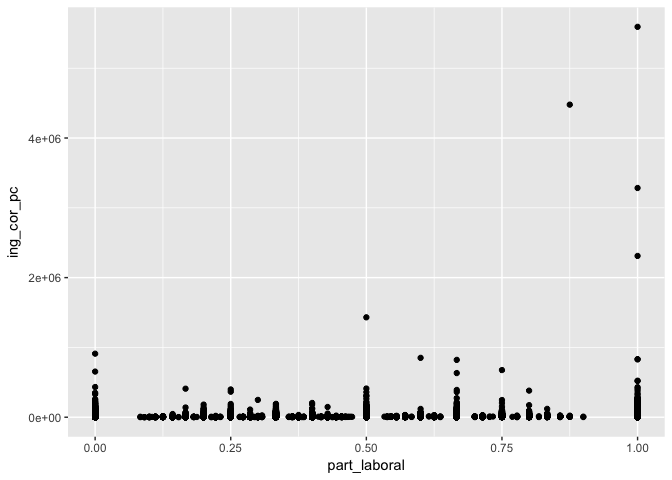
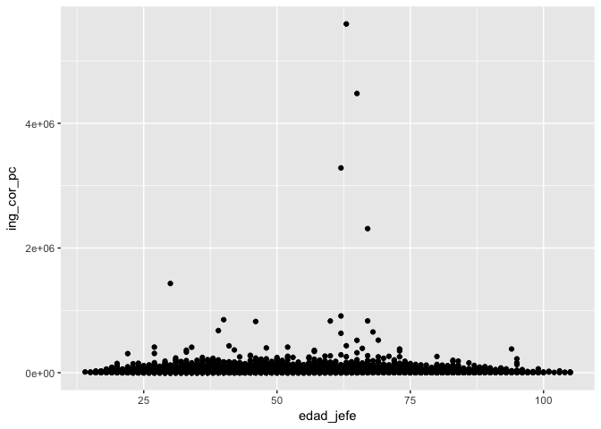
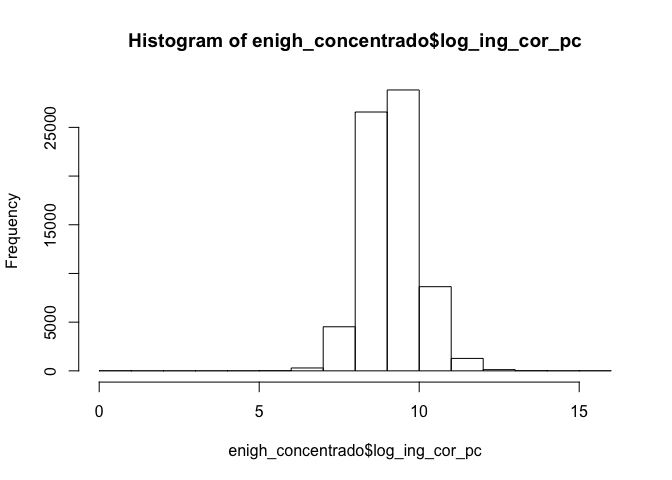
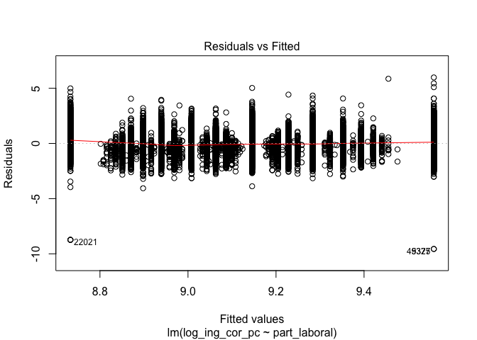
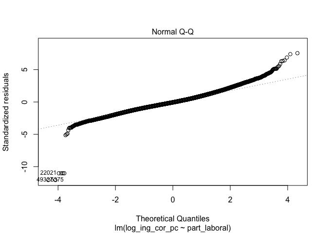
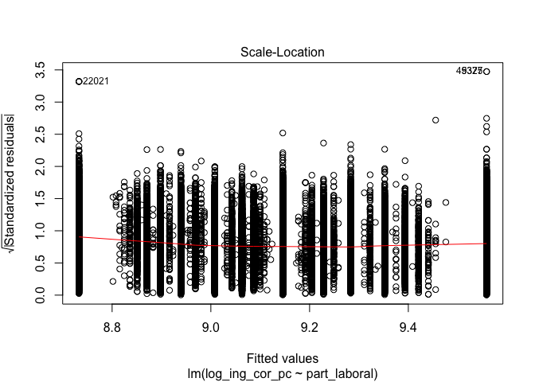
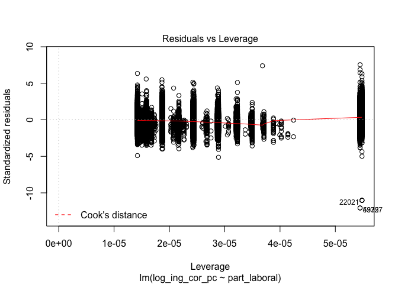
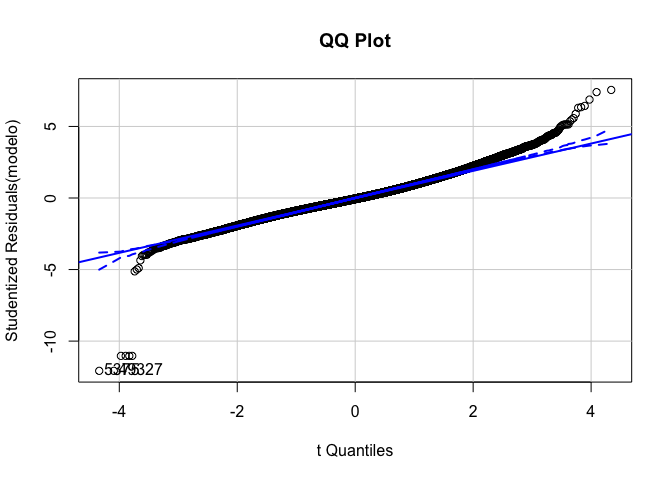
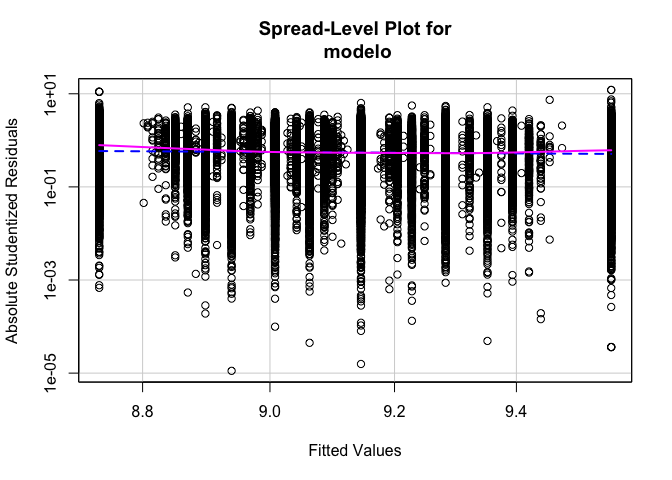

Práctica 7. ANOVA + Regresión lineal
================
AE
24/7/2018

Previo: base de trabajo
=======================

¡Recuerda, poner el directorio!

``` r
setwd("/Users/anaescoto/Dropbox/DGAPA/2018/RMD")
```

En esta práctica vamos a volver a la base de la ENIGH. Con nuestro paquete foreign

``` r
install.packages("foreign", repos = "http://cran.us.r-project.org", dependencies = TRUE)
```

    ## Installing package into '/Users/anaescoto/Library/R/3.3/library'
    ## (as 'lib' is unspecified)

    ## 
    ##   There is a binary version available but the source version is
    ##   later:
    ##         binary source needs_compilation
    ## foreign 0.8-69 0.8-71              TRUE

    ## installing the source package 'foreign'

    ## Warning in install.packages("foreign", repos = "http://cran.us.r-
    ## project.org", : installation of package 'foreign' had non-zero exit status

``` r
library(foreign)
```

Llamamos nuestra base

``` r
enigh_concentrado <- read.dbf("enigh_concentrado_mod.dbf")
```

ANOVA
-----

Análisis de varianza. Haramos la versión más simple. Para ver el efecto de un factor sobre una variable cualitativa. Recordemos que los ingresos per capita son diferentes entre los hogares. Usamos per cápita porque los hogares de distintas estructuras tienen tamaños diferentes

``` r
enigh_concentrado$ing_cor_pc<-enigh_concentrado$ing_cor/enigh_concentrado$tot_integ
```

\[Y recuerda que no tienes que instalar el paquete si ya lo instalaste\]

``` r
install.packages("ggplot2", repos = "http://cran.us.r-project.org", dependencies = TRUE)
```

    ## Installing package into '/Users/anaescoto/Library/R/3.3/library'
    ## (as 'lib' is unspecified)

    ## also installing the dependency 'vdiffr'

    ## 
    ##   There are binary versions available but the source versions are
    ##   later:
    ##         binary source needs_compilation
    ## vdiffr   0.2.1  0.2.3              TRUE
    ## ggplot2  2.2.1  3.0.0             FALSE

    ## installing the source packages 'vdiffr', 'ggplot2'

    ## Warning in install.packages("ggplot2", repos = "http://cran.us.r-
    ## project.org", : installation of package 'vdiffr' had non-zero exit status

    ## Warning in install.packages("ggplot2", repos = "http://cran.us.r-
    ## project.org", : installation of package 'ggplot2' had non-zero exit status

``` r
library(ggplot2)
```

Hoy graficamos

``` r
q<-qplot(log(ing_cor_pc), data=enigh_concentrado, geom="density", fill=factor(clase_hog), alpha=I(.5), 
   main="Distribución de los ingresos corrientes", xlab="Logaritmo", 
   ylab="Density")
q
```

    ## Warning: Removed 6 rows containing non-finite values (stat_density).


¿Cómo establecemos que la organizaci´ón familiar como factor tiene un efecto sobre los ingresos per cápita del hogar?

Para ello nos sirve la ANOVA o análisis de varianza, nos dice cu´ánto de nuestra variable se ve explicado por un factor

``` r
anova <- aov(ing_cor_pc ~ clase_hog, data=enigh_concentrado)
summary(anova)
```

    ##                Df    Sum Sq   Mean Sq F value Pr(>F)    
    ## clase_hog       4 1.628e+12 4.071e+11   307.5 <2e-16 ***
    ## Residuals   70306 9.307e+13 1.324e+09                   
    ## ---
    ## Signif. codes:  0 '***' 0.001 '**' 0.01 '*' 0.05 '.' 0.1 ' ' 1

Supuestos de ANOVA
------------------

-   Las observaciones se obtienen de forma independiente y aleatoria de la población definida por los niveles del factor
-   Los datos de cada nivel de factor se distribuyen normalmente.
-   Estas poblaciones normales tienen una varianza común.

Extra
-----

¿si es significativo cuáles diferencias entre los grupos lo son?

``` r
TukeyHSD(anova)
```

    ##   Tukey multiple comparisons of means
    ##     95% family-wise confidence level
    ## 
    ## Fit: aov(formula = ing_cor_pc ~ clase_hog, data = enigh_concentrado)
    ## 
    ## $clase_hog
    ##                                 diff        lwr        upr     p adj
    ## Corresidentes-Compuesto    15911.633   8260.804  23562.462 0.0000001
    ## Extenso-Compuesto          -1437.869  -5862.638   2986.899 0.9020335
    ## Nuclear-Compuesto           1350.962  -3030.280   5732.204 0.9177873
    ## Unipersonal-Compuesto      15288.626  10788.941  19788.311 0.0000000
    ## Extenso-Corresidentes     -17349.502 -23686.485 -11012.519 0.0000000
    ## Nuclear-Corresidentes     -14560.671 -20867.338  -8254.003 0.0000000
    ## Unipersonal-Corresidentes   -623.007  -7012.525   5766.511 0.9989030
    ## Nuclear-Extenso             2788.832   1884.705   3692.958 0.0000000
    ## Unipersonal-Extenso        16726.495  15359.260  18093.731 0.0000000
    ## Unipersonal-Nuclear        13937.664  12718.633  15156.695 0.0000000

Correlación
===========

Una hipótesis es que los ingresos de los hogares tienen que ver con la tasa de participación que tienen sus integrantes en las estructura familiares

``` r
enigh_concentrado$part_laboral<-enigh_concentrado$ocupados/enigh_concentrado$tot_integ
```

Mide la fuerza de la relación lineal ¡Ojo con lineal!

``` r
qplot(y=ing_cor_pc, x=part_laboral, data=enigh_concentrado)
```



``` r
cor(enigh_concentrado$ing_cor_pc, enigh_concentrado$part_laboral)
```

    ## [1] 0.1056298

``` r
qplot(y=ing_cor_pc, x=edad_jefe, data=enigh_concentrado)
```



``` r
cor(enigh_concentrado$ing_cor_pc, enigh_concentrado$edad_jefe)
```

    ## [1] 0.03092284

Regresión lineal
================

<b>Regresión lineal simple </b>

La regresión lineal nos ayuda a describir esta relación a través de una línea recta.

``` r
enigh_concentrado$log_ing_cor_pc<-log(enigh_concentrado$ing_cor_pc+1)
hist(enigh_concentrado$log_ing_cor_pc)
```



Una vez transformada nuestra variable, corremos el modelo

``` r
cor(enigh_concentrado$log_ing_cor_pc, enigh_concentrado$edad_jefe)
```

    ## [1] 0.08800791

``` r
modelo <-lm(log_ing_cor_pc ~  part_laboral, data=enigh_concentrado, na.action=na.fail)
summary(modelo) # show results
```

    ## 
    ## Call:
    ## lm(formula = log_ing_cor_pc ~ part_laboral, data = enigh_concentrado, 
    ##     na.action = na.fail)
    ## 
    ## Residuals:
    ##     Min      1Q  Median      3Q     Max 
    ## -9.5586 -0.4968 -0.0459  0.4541  5.9785 
    ## 
    ## Coefficients:
    ##              Estimate Std. Error t value Pr(>|t|)    
    ## (Intercept)  8.732869   0.005865 1488.90   <2e-16 ***
    ## part_laboral 0.825684   0.010073   81.97   <2e-16 ***
    ## ---
    ## Signif. codes:  0 '***' 0.001 '**' 0.01 '*' 0.05 '.' 0.1 ' ' 1
    ## 
    ## Residual standard error: 0.7922 on 70309 degrees of freedom
    ## Multiple R-squared:  0.08723,    Adjusted R-squared:  0.08722 
    ## F-statistic:  6719 on 1 and 70309 DF,  p-value: < 2.2e-16

``` r
plot(modelo)
```



Diagnósticos
------------

Instalar paquete "car"

``` r
install.packages("car", repos = "http://cran.us.r-project.org", dependencies = TRUE)
```

    ## Installing package into '/Users/anaescoto/Library/R/3.3/library'
    ## (as 'lib' is unspecified)

    ## 
    ##   There is a binary version available but the source version is
    ##   later:
    ##     binary source needs_compilation
    ## car  2.1-6  3.0-0             FALSE

    ## installing the source package 'car'

``` r
library(carData)
library(car)
```

1.  Outliers

``` r
# Assessing Outliers
outlierTest(modelo) # Bonferonni p-value for most extreme obs
```

    ##         rstudent unadjusted p-value Bonferonni p
    ## 5375  -12.078344         1.4841e-33   1.0435e-28
    ## 49327 -12.078344         1.4841e-33   1.0435e-28
    ## 22021 -11.033105         2.7911e-28   1.9624e-23
    ## 27672 -11.033105         2.7911e-28   1.9624e-23
    ## 48534 -11.033105         2.7911e-28   1.9624e-23
    ## 64411 -11.033105         2.7911e-28   1.9624e-23
    ## 25415   7.549711         4.4147e-14   3.1040e-09
    ## 42170   7.399112         1.3862e-13   9.7465e-09
    ## 57179   6.876878         6.1687e-12   4.3373e-07
    ## 19724   6.432741         1.2612e-10   8.8680e-06

``` r
qqPlot(modelo, main="QQ Plot") #qq plot for studentized resid  (también sirve para normalidad)
```



    ## [1]  5375 49327

1.  Homocedasticidad

``` r
# non-constant error variance test
ncvTest(modelo)
```

    ## Non-constant Variance Score Test 
    ## Variance formula: ~ fitted.values 
    ## Chisquare = 291.6547    Df = 1     p = 2.167834e-65

``` r
# plot studentized residuals vs. fitted values 
spreadLevelPlot(modelo)
```



    ## 
    ## Suggested power transformation:  2.578673
